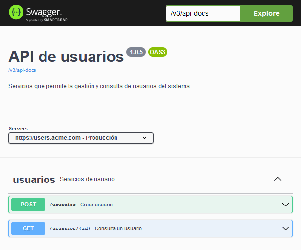

# Demo de Springdoc 

Esta aplicación es una demostración del uso de la librería SpringDoc para generar documentos con el estándar OpenAPI

Para iniciar la aplicación ejecutar el siguiente comando:

```
mvn spring-boot:run
```

El documento se puede visualizar en la siguiente dirección

http://localhost:8080/swagger-ui/




## Referencias

* [Plugin de Maven](https://github.com/springdoc/springdoc-openapi-maven-plugin)
* [Documentación de SpringDoc](https://springdoc.org/)
* [Especificación de OpenAPI](https://spec.openapis.org/oas/latest.html)